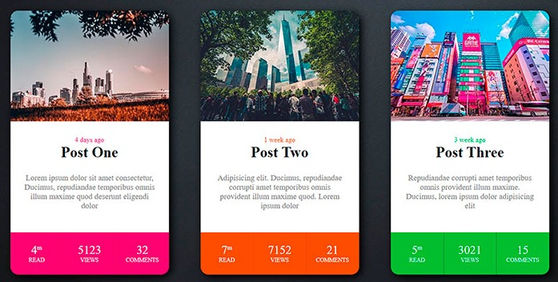

<h1>Instrucciones de actividad</h1>

De las imagenes anterirores selecciona uno de los recuadros y replicalo en el archivo correspondiente con tu nombre

<i>Nota:</i> trabaja sobre la misma hoja de estilo sin afectar el diseño de los demas. La imagenes de los contenedores son de referencia, coloca la imagen de tu preferencia.

 

Ingresa tu nombre aqui, colocando adema el color del contenedor que seleccionaste

